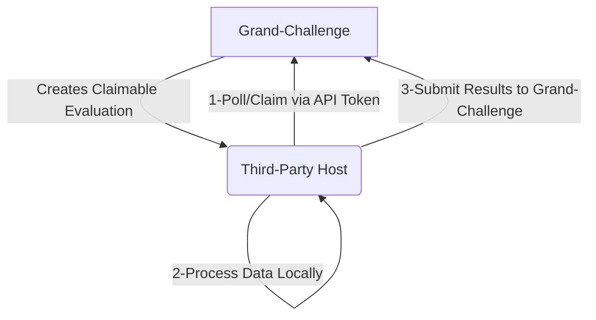

# **Setting up: Grand-Challenge External Evaluation with Indirect Data Access**

This workflow enables hosting a challenge on Grand-Challenge where **data remains on a third-party server**, computations are performed externally, and results are submitted back to Grand-Challenge. Below is a structured breakdown:

---

### **1. Objective**
- **Indirect Data Access**: Sensitive/private data stays on a third-party host (e.g., a hospital server). 
- **External Computation**: Algorithms process data locally on the third-party host. 
- **Centralized Challenge Management**: Grand-Challenge manages user submissions, evaluations, and results without direct data transfer.

---

### **2. Local Development Setup**

#### **Step 1: Spin Up a Local Grand-Challenge Instance**
- **Purpose**: Test the workflow locally before deploying to production.
- **How**: Use Docker/containers via the [development guide](https://github.com/comic/grand-challenge.org/blob/main/app/docs/development.rst). This mimics the live environment.

#### **Step 2: Create Test Environment**
- **Dummy Challenge**:  
  ```bash
  make external_algorithm_evaluation_fixtures  # Creates a challenge with external evaluation settings
  ```
- **Superuser Account**:  
  ```bash
  make superuser  # Generates admin credentials to manage permissions
  ```

---

### **3. Configure Permissions**

#### **Step 3: Grant Evaluator Access**
- **User Role**: External evaluators (e.g., third-party researchers) need permissions to claim evaluations.
- **Steps**:
  1. Log in as the superuser.
  2. Navigate to Django Admin > `auth/group/`(https://gc.localhost/django-admin/auth/group/).
  3. Add the `demo` user to the `algorithm-evaluation-1_external_evaluators` group.  
     *(This group is auto-generated for the dummy challenge.)*

---

### **4. Evaluator Setup**

#### **Step 4: API Token for Automation**
- **Purpose**: Authenticate external systems (e.g., BP's evaluation engine, Apache Airflow) without sharing passwords.
- **Steps**:
  1. Log in as the `demo` user (password: `demo`).
  2. Generate an **API token** in profile settings.  
     *(This token allows the third-party system to interact with Grand-Challenge’s API.)*

---

### **5. Creating a Claimable Evaluation**

#### **Step 5: Simulate a Submission**
1. Login as `demop` user (password: `demop`)
2. **Submit to Algorithm Evaluation Phase** (e.g., placeholder for validation).
3. **Submit to External Algorithm Evaluation Phase** (triggers external processing).  
   - The submission is now listed as a **claimable evaluation** with the submitter’s username.

---

### **6. External Processing Workflow**

#### **Role of Third-Party System (BigPicture)**
1. **Poll for Claimable Evaluations**: Use the `demo` user’s API token to check for unclaimed evaluations.
2. **Claim the Evaluation**: Reserve it to avoid duplicate processing.
3. **Process Data Locally**: Run algorithms on the third-party-hosted data.
4. **Submit Results**: Upload outputs to Grand-Challenge via API.

---

### **Key Concepts**
- **Claimable Evaluations**: Submissions queued for external processing. Only authorized evaluators can claim them.
- **Indirect Data Flow**: Data never leaves the third-party host; only results are transmitted.
- **Security**: API tokens and user groups ensure controlled access.

---

### **Visual Workflow**


This setup is ideal for privacy-sensitive challenges (e.g., medical imaging) where data cannot be centralized. Grand-Challenge manages the challenge lifecycle, while external partners handle computation securely.

---

### **Roles in the Workflow**

#### **1. Superuser**
- **Purpose**: Full administrative access to Grand-Challenge (e.g., managing users, groups, challenges, and permissions).
- **How It’s Used**:
  - Created via `make superuser`.
  - Configures permissions (e.g., adding users to the `external_evaluators` group in Django Admin).
  - Manages the overall challenge setup.
- **Key Actions**:
  - Assigns evaluators to groups.
  - Oversees challenge phases.

---

#### **2. Evaluator (e.g., `demo` user)**
- **Purpose**: An external evaluator who processes data on a third-party server and submits results to Grand-Challenge.
- **How It’s Used**:
  - Added to the `algorithm-evaluation-1_external_evaluators` group via Django Admin.
  - Generates an **API token** to authenticate automated workflows (e.g., BP's evaluation engine, Apache Airflow).
  - Claims evaluations and submits results programmatically.
- **Key Actions**:
  - Uses the API token to poll for and claim evaluations.
  - Runs algorithms on third-party-hosted data.
  - Submits results to Grand-Challenge.

---

#### **3. Participant/Submitter (e.g., `demop` user)**
- **Purpose**: A challenge participant who submits algorithms to the challenge, triggering the creation of a claimable evaluation.
- **How It’s Used**:
  - Submits to the **Algorithm Evaluation** phase (a placeholder step).
  - Submits to the **External Algorithm Evaluation** phase, which queues the submission as a "claimable evaluation."
- **Key Actions**:
  - Interacts with the challenge interface as a regular user.
  - Does **not** require special permissions beyond submitting to the challenge.

---

### **Why the Confusion?**
- **`demo` vs. `demop`**: 
  - `demo` is the **evaluator** (responsible for processing data externally). 
  - `demop` is the **participant** (submits algorithms to the challenge). 

---

### **Recommended Naming Conventions**
To avoid confusion, use **role-specific names** that clearly reflect their purpose. For example:

| **Role**               | **Recommended Name**       | **Description**                                                                 |
|------------------------|----------------------------|---------------------------------------------------------------------------------|
| **Superuser**          | `admin`                    | Default admin account; no change needed.                                        |
| **Evaluator**          | `external_evaluator`       | User responsible for claiming and processing evaluations externally.            |
| **Participant**        | `challenge_participant`    | User who submits algorithms to the challenge.                                   |
| **Evaluation Engine** |    `bigpicture_evaluator`     | Service that uses API token to claim/submit evaluations.|

---

### **Clarified Workflow with Improved Naming**
1. **Superuser (`admin`)**:
   - Creates the challenge.
   - Adds `external_evaluator` to the `external_evaluators` group in Django Admin.

2. **Participant (`challenge_participant`)**:
   - Submits to the challenge’s **External Algorithm Evaluation** phase, creating a claimable evaluation.

3. **Evaluator (`external_evaluator`)**:
   - Generates an API token.
   - Uses the token to claim evaluations and submit results via BP's evaluation engine.

4. **Automation Account**:
   - Dedicated service account for programmatic interactions (avoids tying API tokens to human users).

---

### **Key Takeaways**
- **Avoid Ambiguous Names**: Use distinct names like `external_evaluator` and `challenge_participant` instead of `demo`/`demop`.
- **Separate Roles**: Keep evaluators (external processors) and participants (submitters) as separate users.
- **Service Accounts**: For automated workflows, create dedicated accounts instead of reusing human user accounts.
